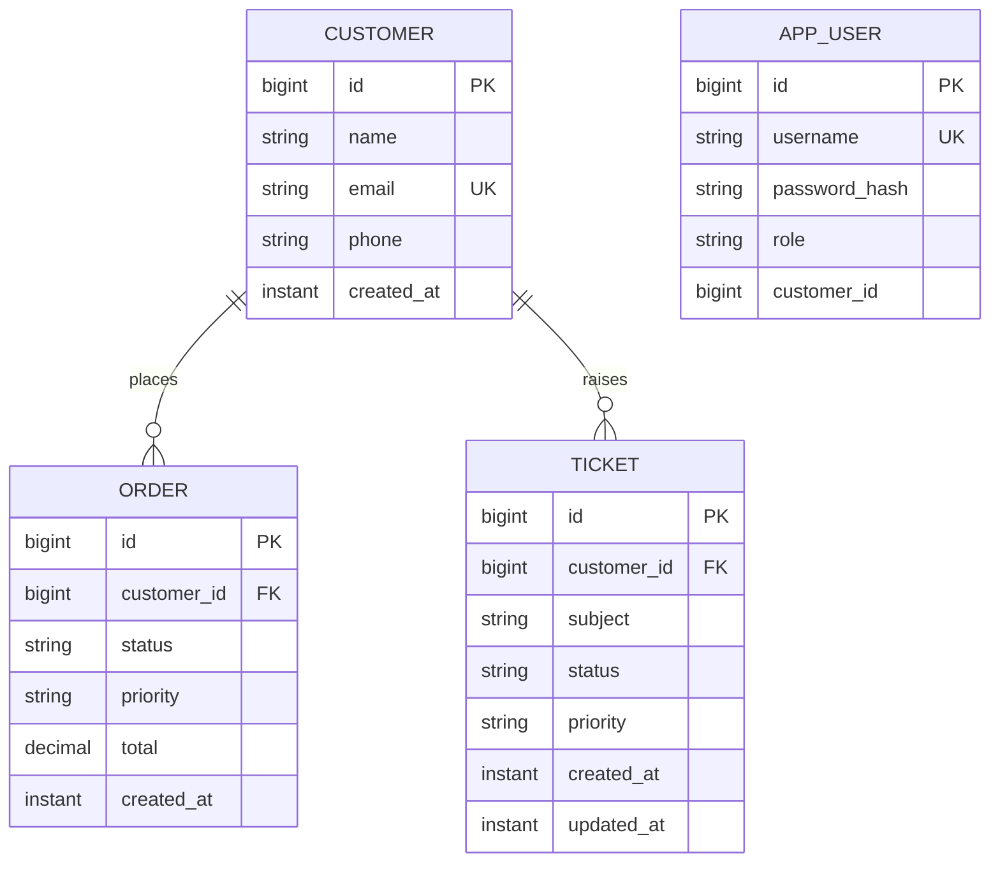

# Portal REST API


## 1. Run the application

From the project root:

```bash
 .\mvnw.cmd spring-boot:run
```


The API starts on `http://localhost:8080`.

The development database is an in-memory H2 database. It is recreated on each application start (`create-drop`). Sample customers, orders, tickets, and users are seeded automatically.

H2 console: `http://localhost:8080/h2-console`

JDBC URL: `jdbc:h2:mem:portaldb`

Username: `sa`

Password: empty

## 2. Demo credentials

| User | Password | Role | Customer ID |
| --- | --- | --- | --- |
| agent01 | Admin123! | ADMIN | — |
| customer01 | Customer123! | CUSTOMER | 1 |
| customer02 | Customer123! | CUSTOMER | 2 |
| customer03 | Customer123! | CUSTOMER | 3 |

These credentials are for local assignment/demo use only.

## 3. Data model / ER diagram



The JPA relationships are represented by `OrderEntity.customer` and `Ticket.customer`. API DTOs expose only scalar/DTO data; JPA entities are not returned directly.

## 4. Authentication

### Login

```http
POST /auth/login
Content-Type: application/json

{
  "username": "agent01",
  "password": "Admin123!"
}
```

Response:

```json
{
  "token": "eyJhbGciOiJIUzI1NiJ9...",
  "expiresIn": 3600
}
```

The signed JWT contains a `roles` claim and the associated `customerId` claim for customer users.

Use the token on protected endpoints:

```http
Authorization: Bearer <token>
```

Invalid credentials return `401 Unauthorized`.

## 5. Authorization rules

| API area | ADMIN | CUSTOMER |
| --- | --- | --- |
| `GET /customers` | Allowed | Forbidden |
| `GET /customers/{customerId}` | Allowed | Forbidden |
| `POST/PUT/DELETE /customers...` | Allowed | Forbidden |
| `GET /customers/{id}/orders...` | All customers | Own customer only |
| `PUT /customers/{id}/orders/{orderId}` | All customers | Own customer only |
| `POST/DELETE` orders | Allowed | Forbidden |
| `GET /customers/{id}/tickets...` | All customers | Own customer only |
| `POST/PUT` tickets | All customers | Own customer only |
| `DELETE` tickets | Allowed | Forbidden |
| `POST/GET /webhooks/subscriptions` | Allowed | Forbidden |
| `/webhooks/incoming/orders` | Public receiver simulation | Public receiver simulation |

Missing or invalid bearer tokens produce `401`. Authenticated users without the required role or ownership receive `403`.

## 6. REST endpoints

### Customers

| Method | Path | Purpose |
| --- | --- | --- |
| GET | `/customers` | List all customers |
| GET | `/customers/{customerId}` | Get one customer |
| POST | `/customers` | Create customer; returns `201 Created` + `Location` |
| PUT | `/customers/{customerId}` | Replace customer |
| DELETE | `/customers/{customerId}` | Remove customer; returns `204 No Content` |

Create example:

```http
POST /customers
Authorization: Bearer <adminToken>
Content-Type: application/json

{
  "name": "Demo Company",
  "email": "demo@example.com",
  "phone": "+962790000099"
}
```

A successful create returns `201 Created` and a `Location` header such as `/customers/5`.

Validation failures return `400 Bad Request` with a JSON body containing `fieldErrors`.

### Orders

| Method | Path | Purpose |
| --- | --- | --- |
| GET | `/customers/{customerId}/orders` | List customer's orders |
| GET | `/customers/{customerId}/orders/{orderId}` | Get one order |
| POST | `/customers/{customerId}/orders` | Create order (ADMIN) |
| PUT | `/customers/{customerId}/orders/{orderId}` | Replace/update order; status change triggers webhook |
| DELETE | `/customers/{customerId}/orders/{orderId}` | Delete order (ADMIN) |

The orders collection supports these query parameters:

| Parameter | Example | Behavior |
| --- | --- | --- |
| `status` | `status=PENDING` | Filters order status |
| `priority` | `priority=HIGH` | Optional additional order filter |
| `sort` | `sort=newest` | Sort by `createdAt`; supported values: `newest`, `oldest`, `createdAt:desc`, `createdAt:asc` |
| `page` | `page=0` | Zero-based page number |
| `size` | `size=10` | Page size, 1–100 |

Unknown query parameters are ignored by the controllers.

Example:

```http
GET /customers/1/orders?status=PENDING&priority=HIGH&sort=newest&page=0&size=10&anything=ignored
Authorization: Bearer <customerToken>
```

Response shape:

```json
{
  "items": [
    {
      "id": 1,
      "customerId": 1,
      "items": ["Laptop", "Docking Station"],
      "status": "PENDING",
      "priority": "HIGH",
      "total": 1250.00,
      "createdAt": "2026-09-30T12:00:00Z"
    }
  ],
  "page": 0,
  "size": 10,
  "totalElements": 1,
  "totalPages": 1
}
```

### Tickets

| Method | Path | Purpose |
| --- | --- | --- |
| GET | `/customers/{customerId}/tickets` | List customer's tickets |
| GET | `/customers/{customerId}/tickets/{ticketId}` | Get one ticket |
| POST | `/customers/{customerId}/tickets` | Raise a ticket |
| PUT | `/customers/{customerId}/tickets/{ticketId}` | Update ticket; status change broadcasts over WebSocket |
| DELETE | `/customers/{customerId}/tickets/{ticketId}` | Delete ticket (ADMIN) |

Supported ticket query parameters:

- `status`: `OPEN`, `IN_PROGRESS`, `RESOLVED`, `CLOSED`
- `priority`: `LOW`, `MEDIUM`, `HIGH`
- `page`: zero-based page number
- `size`: 1–100

Unknown query parameters are ignored.

## 7. Webhook simulation

### Register a subscriber

```http
POST /webhooks/subscriptions
Authorization: Bearer <adminToken>
Content-Type: application/json

{
  "url": "http://localhost:8080/webhooks/incoming/orders",
  "eventType": "order.status_changed"
}
```

Subscriptions are intentionally held in memory for this assignment.

### Trigger the webhook

Update an order so its status changes, for example `PENDING -> SHIPPED`:

```http
PUT /customers/1/orders/1
Authorization: Bearer <token>
Content-Type: application/json

{
  "items": ["Laptop", "Docking Station"],
  "status": "SHIPPED",
  "priority": "HIGH",
  "total": 1250.00
}
```

The API persists the change and calls the webhook delivery method asynchronously, so the caller does not wait for the receiver HTTP request.

Example payload:

```json
{
  "event": "order.status_changed",
  "orderId": 1,
  "previousStatus": "PENDING",
  "newStatus": "SHIPPED",
  "occurredAt": "2026-09-30T12:15:00Z"
}
```

The request includes:

```http
X-Digitinary-Signature: sha256=<hex-hmac>
```

### Receiver verification

The demo receiver at `POST /webhooks/incoming/orders` calculates its own HMAC-SHA256 using the configured shared secret and compares it to the header. It logs the raw payload and returns `200` only when the signature is valid; an invalid signature returns `401`.

The shared demo secret is configured in `application.yml` under `app.webhook.secret`.

There is intentionally no retry/backoff implementation because that is an optional bonus requirement.

## 8. WebSocket / STOMP

WebSocket endpoint:

```text
/ws
```

SockJS fallback is enabled.

Clients subscribe to:

```text
/topic/tickets
```

When a ticket is created or its status changes, the server broadcasts:

```json
{
  "ticketId": 15,
  "customerId": 7,
  "subject": "VPN issue",
  "status": "IN_PROGRESS",
  "priority": "HIGH",
  "updatedAt": "2026-09-30T12:20:00Z"
}
```

Test page:

`http://localhost:8080/websocket-test.html`

Open that page, click **Connect**, then create or update a ticket from Postman. The update appears live without refreshing the page.


## 9. Project structure

```text
src/main/java/com/digitinary/customercare/
├── config/        async config + sample data
├── controller/    REST controllers
├── dto/           request/response DTOs
├── entity/        JPA entities + enums
├── exception/     API exceptions + global error handler
├── repository/    Spring Data repositories
├── security/      JWT + Spring Security configuration
├── service/       business logic
├── webhook/       subscription, signing, async delivery
└── websocket/     STOMP configuration + update message

src/main/resources/
├── application.yml
└── static/websocket-test.html


```

## 10. Bonus challenges

Not implemented

